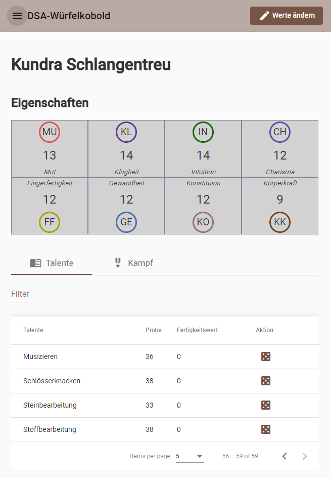
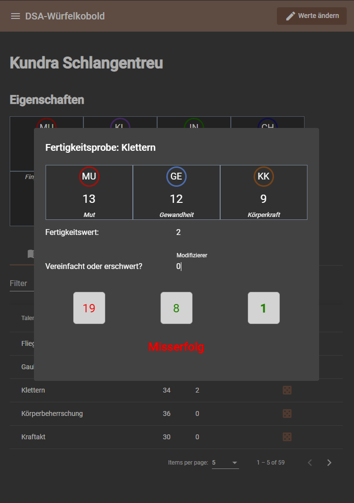
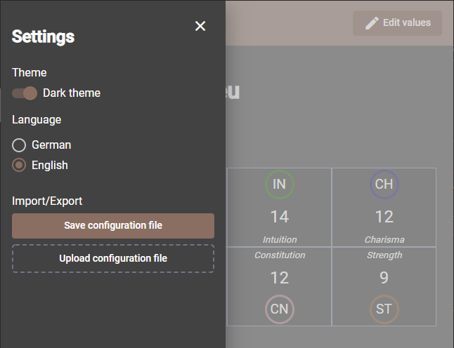

# DSA-Würfelkobold

This is a small helper for the German pen & paper role-playing game "Das schwarze Auge".

## Features

-   Player attributes, talent values and some combat values: Data is saved on the user's computer - nothing is transmitted over the web.
-   Export your player's data as a JSON file. Import the file to restore the data.
-   Theming: Light/Dark mode
-   Languages supported: German, English
-   Some screenshots:

